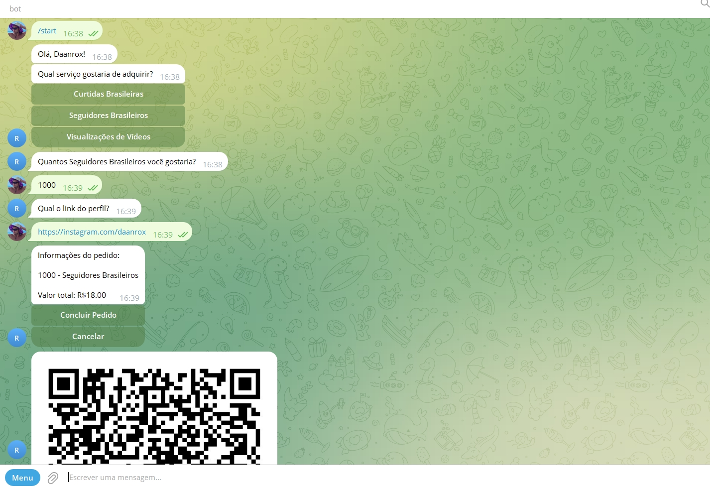

# Bot de Pedidos e Pagamentos via Telegram



## Descrição
Este projeto é um bot de pedidos e pagamentos desenvolvido para o Telegram, com o objetivo de automatizar o processo de compra de produtos e serviços através de uma conversa fluida e interativa com os usuários. O bot captura informações essenciais do cliente, gera um QR Code de pagamento exclusivo para cada transação, e registra os pedidos em um banco de dados MySQL.

Integrado com uma gateway de pagamento, o bot atualiza automaticamente o status dos pagamentos utilizando webhooks, proporcionando uma experiência otimizada e sem necessidade de intervenção manual. O sistema é desenvolvido em Python, utilizando bibliotecas robustas como mysql.connector, requests, e python-telegram-bot, garantindo uma operação eficiente e segura.

### Deploy
Aplicação em produção: [https://t.me/ROXSMMBOT](https://t.me/ROXSMMBOT)

## Tecnologias Utilizadas
- Python
- MYSQL
- PHP

## Funcionalidades
- **Autenticação Automática via Telegram:** O sistema utiliza a autenticação integrada do Telegram, capturando automaticamente os dados do usuário para uma experiência personalizada e segura.
- **Fluxo Automatizado de Conversas:** O bot conduz o cliente de maneira fluida e interativa, fornecendo informações sobre produtos e serviços, capturando dados essenciais para o pedido, e guiando o usuário em todas as etapas do processo de compra.
- **Integração com Gateway de Pagamento:** Para cada pedido, o bot gera um QR Code de pagamento único através da integração com uma gateway de pagamentos, facilitando a finalização do pedido diretamente no chat.
- **Geração de QR Code:** Utilizando a biblioteca de geração de QR codes, o bot cria um código de pagamento visual para cada transação, enviado diretamente ao cliente via Telegram.
- **Registro Automático de Pedidos no Banco de Dados:** Todos os pedidos são registrados automaticamente no banco de dados MySQL utilizando mysql.connector, permitindo o gerenciamento eficiente e centralizado dos dados de compra.
- **Atualização de Status de Pagamento via Webhook:** O sistema de webhook permite a atualização automática do status de pagamento, confirmando quando um pedido foi concluído com sucesso. O webhook pode ser facilmente adaptado para diferentes sistemas de entrega ou confirmação de pedido.
- **Notificações em Tempo Real:** O bot utiliza notificações no chat para informar o usuário sobre cada etapa do processo, como a geração do pedido, status de pagamento e confirmação de compra.
- **Bibliotecas Python Otimizadas:** Desenvolvido com bibliotecas como requests, mysql.connector, e python-telegram-bot, garantindo eficiência nas requisições HTTP e manipulação de dados.
- **Sistema Fluido e Interativo:** O bot oferece uma experiência conversacional amigável, respondendo rapidamente às interações do usuário, tornando o processo de compra simples e eficiente.
- **Fácil Integração e Adaptação:** O sistema foi projetado para ser adaptável a diferentes modelos de entrega e notificações, permitindo fácil integração com sistemas de terceiros.


## Executando o Projeto

### Pré-requisitos
Certifique-se de ter o Python instalado.

### Criação do Ambiente Virtual
No diretório do projeto, execute o seguinte comando para criar um ambiente virtual chamado venv:

```bash
python -m venv venv
```
### Ativação do Ambiente Virtual
No Windows:

```bash
venv\Scripts\activate
```
No macOS/Linux:

```bash
source venv/bin/activate
```

### Instalação das Dependências
Com o ambiente virtual ativado, instale as dependências listadas no arquivo requirements.txt com o seguinte comando:

```bash
pip install -r requirements.txt
```

### Executando o Arquivo main.py
Para rodar o projeto, utilize o comando abaixo, ainda com o ambiente virtual ativado:

```bash
python main.py
```

Certifique-se de que todas as variáveis de ambiente necessárias estejam definidas corretamente no arquivo .env.

## Doação

Para fazer uma doação em agradecimento por algum projeto! Acesse: [https://roxcheckout.shop](https://roxcheckout.shop)

## Contato
Se tiver dúvidas ou precisar de mais informações, sinta-se à vontade para entrar em contato:
- Email : [contato@daanrox.com](mailto:contato@daanrox.com)
- LinkedIn: [https://www.linkedin.com/in/daanrox/](Daanrox)

--- 

"Consagre ao Senhor tudo o que você faz, e os seus planos serão bem-sucedidos."
